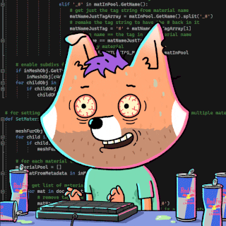
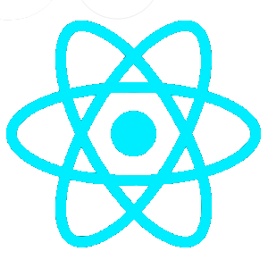
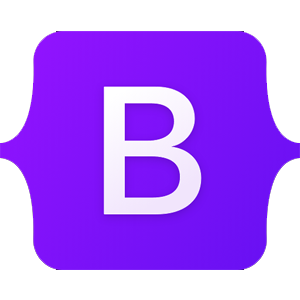
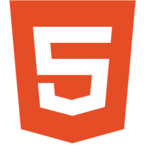
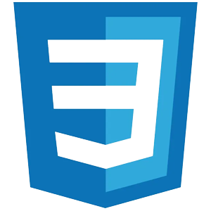
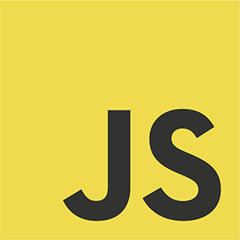
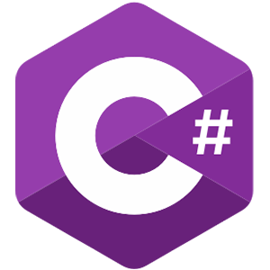
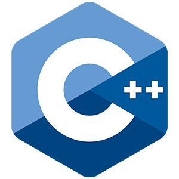
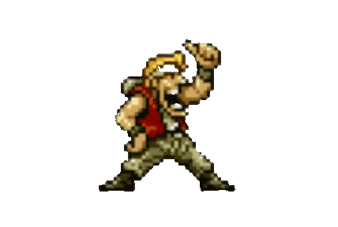

---
 

## 📝About Me
- :books: Hello! My name is Rennê Bispo and I have a degree in Information Systems from the Federal University of Sergipe. I am developer focused on stacks such.  
- 🔭 Currently learning <b>how to be BETTER</b>  
- 🚀 Contributing to the <a href="https://github.com/marcosdosea/RestauranteAki">RestauranteAki</a> project (.Net, ASP.NET, MySQL, Entity Framework, Identity...)   
- 🛠️ See my actual project with Boostrap, html e css:  <a href="https://renneb777.github.io/-renne.github.io/">ItaCerâmica</a> 
- 🛠️ And Customer registration with Python,  in <a href="https://github.com/renneb777/Cinema" target="_blank">Cinema</a> 
- See Also: <a href="https://github.com/renneb777/Dieta-2022" target="_blank">Sistema de Dieta</a> 
  
---

  <h1> 🚀 Skills 🚀 </h1>
  

   Legend:  
   ✯ - Main ✦ - Knowledge ☻ - Learning
  

  <h2> Frameworks </h2>
  ✯
  <code></code>
  <code></code>
  <code></code>
   
   <!-- Adicionar mais habilidades  --> 
   

  <h2> Stack/Technologies </h2>
  ✯
  <code></code>
  <code></code>
  <code></code>
  <code></code>
  <code></code>
   
  ✦
  <code></code>
  <code></code>

  <h2> Databases SQL/NoSQL </h2>
  ✯
  <code></code>
   
  <!-- ✦ Adicionar mais habilidades  --> 

---
<!-- 📊 Cards com estilo lado a lado e mesmo tamanho -->

  <table>
    <tr>
      <td>
        
      </td>
      <td>
       
      </td>
    </tr>
  </table>

 ---

## Contact

 
 <!-- -->
 
 

---

 
 

