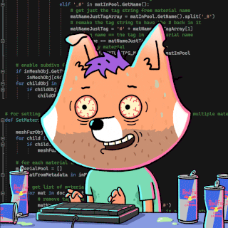
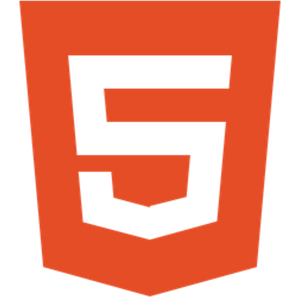
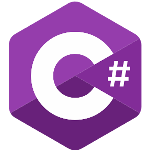
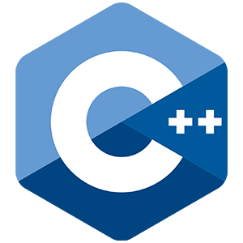
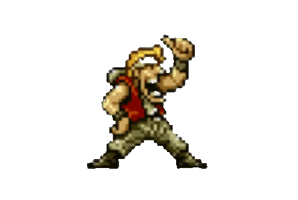

---

## 📝 About Me
- :books: Hello! My name is Rennê Bispo and I have a degree in Information Systems from the Federal University of Sergipe. I am developer focused on stacks such.  
- 🔭 Currently learning <b>how to be BETTER</b>  
- 🚀 Contributing to the <a href="https://github.com/marcosdosea/RestauranteAki">RestauranteAki</a> project (.Net, ASP.NET, MySQL, Entity Framework, Identity...)  
- 🛠️ See my actual project with Boostrap, html e css: <a href="https://renneb777.github.io/-renne.github.io/">ItaCerâmica</a> 
- 🛠️ And Customer registration with Python, in <a href="https://github.com/renneb777/Cinema" target="_blank">Cinema</a> 
- See Also: <a href="https://github.com/renneb777/Dieta-2022" target="_blank">Sistema de Dieta</a> 

 

---

# 🚀 Skills 🚀

<h3>Frameworks</h3>

<table align="center" style="border: none;">
  <tr>
    <td align="center" style="border: none; padding: 0 8px;">✯</td>
    <td align="center" style="border: none; padding: 0 8px;">
      
    </td>
    <td align="center" style="border: none; padding: 0 8px;">
      
    </td>
    <td align="center" style="border: none; padding: 0 8px;">
      
    </td>
    <td align="center" style="border: none; padding: 0 8px;">
      
    </td>
  </tr>
</table>

<!-- Adicionar mais habilidades -->

<h3>Stack / Technologies</h3>

<table align="center" style="border: none;">
  <tr>
    <td align="center" style="border: none; padding: 0 8px;">✯</td>
    <td align="center" style="border: none; padding: 0 8px;">
      
    </td>
    <td align="center" style="border: none; padding: 0 8px;">
      
    </td>
    <td align="center" style="border: none; padding: 0 8px;">
      
    </td>
    <td align="center" style="border: none; padding: 0 8px;">
      
    </td>
    <td align="center" style="border: none; padding: 0 8px;">
      
    </td>
    <td align="center" style="border: none; padding: 0 8px;">
      
    </td>
    <td align="center" style="border: none; padding: 0 8px;">
      
    </td>
  </tr>
  <tr>
    <td align="center" style="border: none; padding: 8px;">✦</td>
    <td align="center" style="border: none; padding: 8px;">
      
    </td>
    <td align="center" style="border: none; padding: 8px;">
      
    </td>
  </tr>
</table>

<h3>Databases SQL</h3>

<table align="center" style="border: none;">
  <tr>
    <td align="center" style="border: none; padding: 0 8px;">✯</td>
    <td align="center" style="border: none; padding: 0 8px;">
      
    </td>
    <td align="center" style="border: none; padding: 0 8px;">
      
    </td>
    <td align="center" style="border: none; padding: 0 8px;">
      
    </td>
  </tr>
</table>

<!-- ✦ Adicionar mais habilidades -->

---

  
    
  

